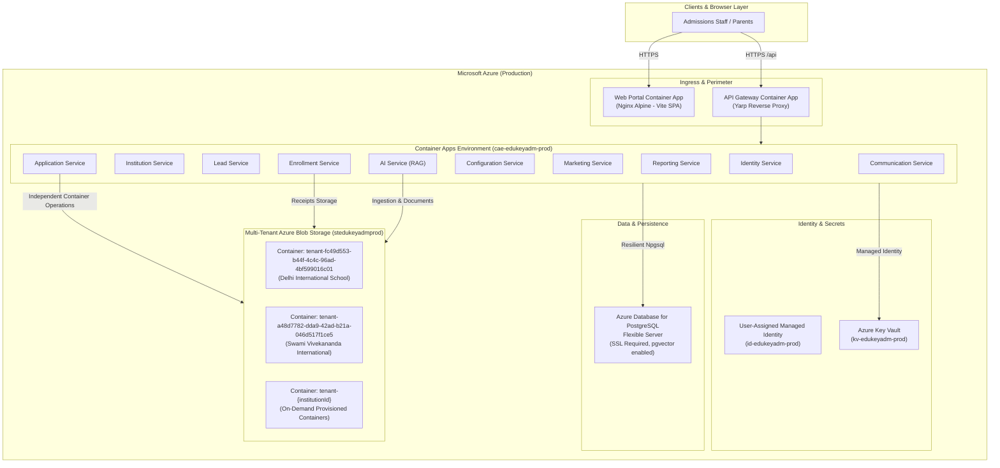

# Azure Production Deployment & Architecture Guide

**EduKey Admission Assist** is engineered for enterprise production deployment on Microsoft Azure, featuring:
1. **Independent Azure Blob Storage per Educational Institution** (`tenant-{institutionId}`)
2. **Centralized Secret & Key Management in Azure Key Vault** (`kv-edukeyadm-prod`)
3. **Azure Database for PostgreSQL Flexible Server** (`psql-edukeyadm-prod`) with `pgvector` extension and transient fault resiliency
4. **Serverless Containerized Microservices on Azure Container Apps (ACA)** with User-Assigned Managed Identity

---

## 1. System Architecture



---

## 2. Independent Storage for Every Institution (Azure Blob Storage)

### Architecture & Isolation Strategy
- **Container-per-Tenant Model**: Every registered school/institution receives a dedicated, physically isolated Azure Blob Storage container named:
  ```
  tenant-{institutionId:D:lowercase}
  ```
  - *Example (DIS)*: `tenant-fc49d553-b44f-4c4c-96ad-4bf599016c01`
  - *Example (SVIS)*: `tenant-a48d7782-dda9-42ad-b21a-046d517f1ce5`
- **Security & Authorization**:
  - Direct public access to blob containers is disabled (`PublicAccess = None`).
  - Read access is granted dynamically via **Time-Limited Shared Access Signature (SAS) tokens** generated per request (`GET /api/applications/documents/{id}/sas-url`) or secure server-side streaming (`GET /api/applications/documents/{id}/download`).
  - Strict tenant boundary verification: Users from School A can never read, list, or access documents from School B.
- **Tenant Directory Hierarchy**:
  Inside each tenant container, files are categorized by subfolder:
  ```
  tenant-{institutionId}/
  ├── documents/       # Prospectuses, fee structures, policies, circulars
  ├── applications/    # Applicant birth certificates, transfer certificates, report cards
  ├── receipts/        # Official Razorpay fee payment receipts
  └── media/           # Campus photos, tour video clips, audio notes
  ```
- **Service Registration**:
  Available across microservices via `builder.Services.AddTenantAzureBlobStorage()` from `MySchoolAdmissions.Core.Storage`.

---

## 3. Azure Key Vault Secrets & Configuration

All secrets and cryptographic keys are loaded dynamically at runtime via **Azure Key Vault** using `DefaultAzureCredential` (Managed Identity):

| Key Vault Secret Name | ASP.NET Core Config Mapping | Purpose |
|---|---|---|
| `ConnectionStrings--DefaultConnection` | `ConnectionStrings:DefaultConnection` | Azure PostgreSQL default connection string |
| `ConnectionStrings--ApplicationDb` | `ConnectionStrings:ApplicationDb` | Application microservice database |
| `ConnectionStrings--EnrollmentDb` | `ConnectionStrings:EnrollmentDb` | Enrollment & fee payment database |
| `ConnectionStrings--IdentityDb` | `ConnectionStrings:IdentityDb` | Identity & RBAC database |
| `ConnectionStrings--AiDb` | `ConnectionStrings:AiDb` | AI Service & pgvector embeddings |
| `Jwt--Key` | `Jwt:Key` | JWT signing secret (256-bit) |
| `Jwt--Issuer` | `Jwt:Issuer` | JWT token issuer |
| `Jwt--Audience` | `Jwt:Audience` | JWT audience identifier |
| `Razorpay--KeyId` | `Razorpay:KeyId` | Razorpay Merchant Key ID |
| `Razorpay--KeySecret` | `Razorpay:KeySecret` | Razorpay API Secret |
| `Razorpay--WebhookSecret` | `Razorpay:WebhookSecret` | Razorpay Webhook Signature secret |
| `AzureStorage--ConnectionString` | `AzureStorage:ConnectionString` | Azure Storage account primary connection |
| `Meta--WhatsApp--VerifyToken` | `Meta:WhatsApp:VerifyToken` | WhatsApp Cloud API webhook token |
| `AI--OpenAIKey` | `AI:OpenAIKey` | Azure OpenAI or OpenAI API Key |
| `AI--GeminiApiKey` | `AI:GeminiApiKey` | Google Gemini API Key |

---

## 4. Azure Database for PostgreSQL Flexible Server

- **Server Engine**: Azure Database for PostgreSQL Flexible Server (Version 15/16).
- **SSL / TLS**: Enforced with `Ssl Mode=Require;Trust Server Certificate=true;`.
- **Extensions Installed**:
  - `vector` (pgvector for AI RAG embeddings in `myschooladmissionsai`)
  - `uuid-ossp` (Universally Unique Identifier generation)
- **High-Resiliency Connection Pooling**:
  Configured with `EnableRetryOnFailure(maxRetryCount: 5, maxRetryDelay: TimeSpan.FromSeconds(30))` in `AddAzurePostgreSqlDbContext<T>()`.
- **Database Partitioning**:
  Each microservice owns its dedicated database on the flexible server:
  - `MySchoolAdmissionsIdentity`
  - `MySchoolAdmissionsInstitution`
  - `MySchoolAdmissionsLead`
  - `MySchoolAdmissionsApplication`
  - `MySchoolAdmissionsConfiguration`
  - `MySchoolAdmissionsEnrollment`
  - `MySchoolAdmissionsMarketing`
  - `MySchoolAdmissionsReporting`
  - `myschooladmissionsai`

---

## 5. Deployment Guide

### Option A: 1-Click Automated Deployment (PowerShell)
```powershell
# Run from repository root:
.\deploy-to-azure.ps1 `
    -ResourceGroupName "rg-edukey-admissions-prod" `
    -Location "centralindia" `
    -EnvironmentName "prod" `
    -ResourcePrefix "edukeyadm" `
    -PostgresAdminPassword "YourSecurePassword2026!"
```

### Option B: 1-Click Automated Deployment (Bash)
```bash
chmod +x ./deploy-to-azure.sh
./deploy-to-azure.sh "rg-edukey-admissions-prod" "centralindia" "prod" "edukeyadm" "YourSecurePassword2026!"
```

### Option C: Manual Bicep Deployment
```bash
# 1. Create Resource Group
az group create --name rg-edukey-admissions-prod --location centralindia

# 2. Deploy Bicep
az deployment group create \
    --resource-group rg-edukey-admissions-prod \
    --template-file ./infra/main.bicep \
    --parameters ./infra/main.parameters.json \
    --parameters postgresAdminPassword="YourSecurePassword2026!"

# 3. Initialize Tenant Containers
pwsh ./infra/scripts/init-tenant-storage.ps1 -ResourceGroupName rg-edukey-admissions-prod -StorageAccountName stedukeyadmprod

# 4. Populate Key Vault Secrets
pwsh ./infra/scripts/setup-azure-keyvault-secrets.ps1 -KeyVaultName kv-edukeyadm-prod -PostgreSqlHost psql-edukeyadm-prod.postgres.database.azure.com -PostgreSqlAdminUser admissionsadmin -PostgreSqlAdminPassword "YourSecurePassword2026!"
```
