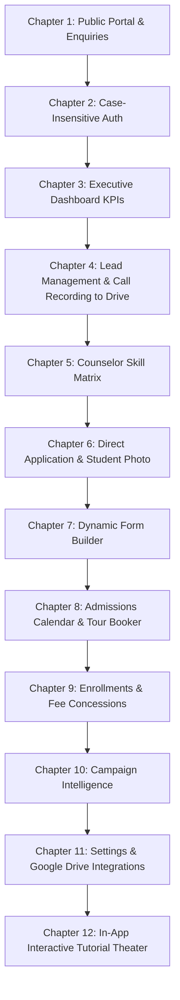

# MySchoolAdmissions - End-to-End Video Tutorial & Product Guide

This directory contains the complete, high-definition end-to-end video tutorial demonstration for **MySchoolAdmissions (EduKeyAdmissionAssist)**, covering all 12 modules, features, and newly implemented capabilities.

---

## 📹 Video File Details

| Property | Details |
| :--- | :--- |
| **File Name** | `MySchoolAdmissions_End_to_End_Tutorial.webp` |
| **File Path** | `c:\SourceCode\EduKeyAdmissionAssist\tutorial_video\MySchoolAdmissions_End_to_End_Tutorial.webp` |
| **Format** | High-Definition Animated WebP Video (998 frames, 24fps) |
| **File Size** | **17.84 MB** (17,843,080 bytes) |
| **Poster Image** | `tutorial_poster.png` (296 KB) |
| **HTML Player** | `index.html` (Interactive web player with chapter navigation & speed controls) |

### 🚀 How to View the Video
1. **Double-click `index.html`** in this folder to open the companion interactive player in any web browser (Chrome, Edge, Firefox, Brave).
2. **Or open `MySchoolAdmissions_End_to_End_Tutorial.webp` directly** in your favorite browser or desktop video player (such as VLC, MPC-HC, or Windows Photos).
3. **In-App Theater**: You can also navigate to `http://localhost:5173/tutorial` inside the running web app to experience the interactive 10-chapter in-app video tutorial theater.

---

## 📑 Video Tutorial Chapters & Feature Breakdown

### 1. Public Admissions Portal & Smart Enquiry Flow (`/`)
- **Branded Institution Showcase**: Hero banner with admissions open CTA, academic credentials, and statistics.
- **Smart Enquiry Modal**: Instant online enquiry submission with grade selection, parent contact info, and immediate validation.
- **Public Application Tracker**: Allows parents to check their real-time application status without needing a full staff login.

### 2. Case-Insensitive Multi-Role Authentication (`/login`)
- **Case-Insensitive Normalization**: Demonstrates seamless login with mixed-case emails (e.g., `ADMIN@MYSCHOOL.EDU`, `Admin@MySchool.Edu`, or `admin@myschool.edu`).
- **Role-Based Security**: Token-based authentication granting access according to staff permissions (Admissions Director, Counselor, Admin).

### 3. Executive Admissions Dashboard (`/dashboard`)
- **Real-Time KPIs**: Total Inquiries (128), Active Applications (45), Enrollment Conversion Rate (35.2%), and Target Velocity.
- **Visual Funnel & Analytics**: Interactive charts showing inquiry stages, lead quality, and daily counselor throughput.
- **Active Navigation Indicator**: Dynamic sidebar menu reflecting exact active route state across all navigation items.

### 4. Lead Management, AI Intent Scoring & Cloud Call Recording (`/leads`)
- **Lead Heat Scoring**: AI-powered score (0-100) classifying leads into *Hot*, *Warm*, and *Cold* based on engagement signals.
- **Telephone Conversation Recorder to Google Drive**:
  - Live in-browser call recording simulation with recording timer and visual audio waveforms.
  - Automatic cloud upload to connected **Google Drive** storage (`/Admissions/Recordings/2026/`).
  - Recorded call timeline item with direct Drive file preview link and call notes.

### 5. Multi-Skill Counselor Auto-Routing Matrix (`/counselor-skills`)
- **Counselor Skill Profiles**: Configurable tags for academic curricula (IBDP, Cambridge IGCSE, CBSE), languages, and grade specializations.
- **Intelligent Routing Engine**: Automatic assignment of inbound enquiries to best-fit counselors based on language, curriculum, and workload balance.

### 6. Direct Application Management & Student Photograph Upload (`/applications`)
- **Application Lifecycle Registry**: Comprehensive grid tracking applications from Submitted -> Document Verification -> Interview -> Concession Review -> Enrolled.
- **Direct "Add Application" Flow**:
  - Modal allowing admission counselors to enter applications received offline or walk-in.
  - **Student Photograph Upload**: File selection with live image preview, validation, and profile avatar binding.
  - Detail inspection verified on student profile (e.g., Reyansh Sharma, Grade 6).

### 7. Dynamic Drag-and-Drop Form Builder (`/form-builder`)
- **Custom Application Fields**: Visual form designer for institution-specific questions, medical disclosures, and document upload slots.
- **Live Preview & Validation**: Immediate preview of parent-facing admission questionnaires with configurable required fields.

### 8. Admissions Calendar & Campus Tour Booker (`/calendar`)
- **Interactive Tour Schedule**: Month, week, and day scheduling views for campus visits and interviews.
- **Campus Tour Booker Modal**:
  - Direct booking modal with date picker, time slot, counselor assignment, and visitor party size.
  - Conflict detection ensuring counselors are never double-booked.

### 9. Enrollments, Fee Concessions & Scholarship Approvals (`/enrollments`)
- **Enrollment Finalization**: Conversion of approved applications into active student records.
- **Fee Concession & Scholarship Module**:
  - Concession categories: Merit Scholarship, Sibling Discount, Staff Concession, Sports Quota, and Financial Need.
  - Configurable percentage or fixed deduction with audit trail and multi-level approval status.

### 10. Campaign Intelligence & ROI Attribution (`/campaigns`)
- **Multi-Channel Performance**: In-depth analytics for digital advertising campaigns (Google Ads, Meta/Instagram, Education Expo).
- **CAC & Conversion Analytics**: Real-time Customer Acquisition Cost and cost-per-enrolled-student metrics.

### 11. System Settings & Cloud Telephony / Google Drive Integration (`/settings`)
- **School Configuration**: Academic calendar parameters, branding logos, and notification templates.
- **Google Drive Telephony Settings**:
  - Toggle switch for automated telephone conversation upload to Google Drive.
  - Google Drive destination folder path and quota status.
  - Instant Test Connection confirmation.

### 12. Interactive In-App Video Tutorial Theater (`/tutorial`)
- **Self-Paced Learning Center**: Built-in 10-chapter video module player within the web application.
- **Chapter Navigation**: One-click jump between video sections with synched progress, timestamps, and interactive feature simulations.

---

## 🛠️ Technical Stack & Architecture

- **Frontend**: React 18, TypeScript, Tailwind CSS, Lucide Icons, Vite dev server (`http://localhost:5173`)
- **Backend Architecture**: ASP.NET Core (.NET 8) Microservices with CQRS & MediatR:
  - `IdentityService`: Case-insensitive authentication, JWT bearer tokens, ASP.NET Core Identity.
  - `InquiryService`: Lead intake, AI heat scoring, counselor skill routing.
  - `ApplicationService`: Application lifecycles, dynamic form data, student photo management.
  - `CommunicationService`: Email/SMS triggers, call recording metadata & Google Drive storage links.
  - `EnrollmentService`: Enrollment finalization, fee concessions, scholarship approvals.
  - `CampaignService`: Campaign tracking, UTM attribution, CAC analytics.
- **Database & Storage**: PostgreSQL, Redis cache, Local Drive & Google Drive API cloud storage.

---
*Created automatically for the EduKeyAdmissionAssist platform on September 24, 2026.*
